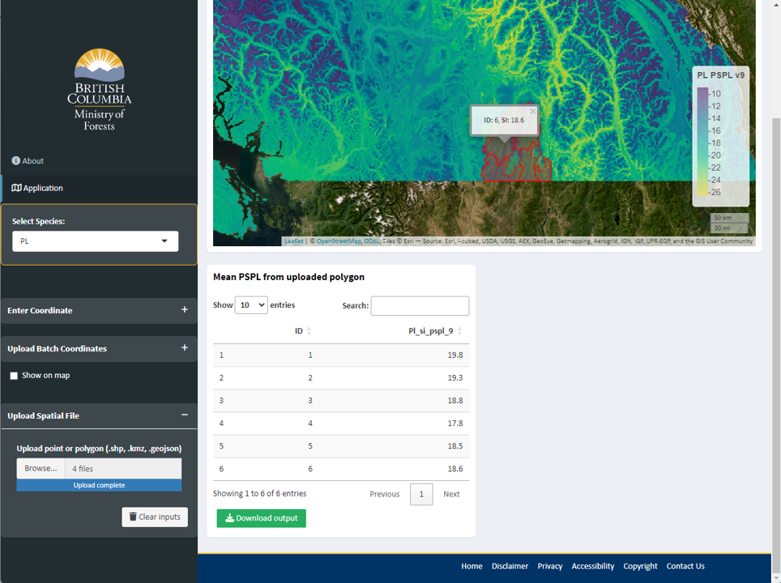

```{r setup, include=FALSE}
knitr::opts_chunk$set(echo = F)
```

## Background

The **Provincial Site Productivity Layer (PSPL)** provides **area-based site index estimates** for **14 commercial tree species across British Columbia (BC)**. The PSPL v.9.0 was developed and is managed by the Forest Analysis and Inventory Branch (FAIB) to address several limitations of PSPL v.8.0 by: 1) reducing discrepancies between PSPL estimates and field-measured site productivity, 2) filling gaps in estimates across large areas, and 3) establishing a more systematic and updateable modelling framework.  

PSPL v.9.0 adopts a machine learning-based *Random Forest (RF) modelling approach* that incorporates climatic, topographic, and ecosystem classification predictor variables. More than 13,000 ground-based site index observations from *FAIB ground sampling inventories, Site Index Biogeoclimatic Ecosystem Classification (SIBEC), and Site Index Adjustment (SIA) projects* were used to develop and validate the models. Validation results demonstrated that PSPL v.9.0 outperformed the previous v.8.0 in site index prediction accuracy for all species except black spruce, with particularly strong improvements for key commercial species including *Douglas-fir, lodgepole pine, western hemlock, western redcedar, and subalpine fir*. The new PSPL also establishes a reproducible and scalable predictive modelling framework that provides wall-to-wall coverage across BC at a **100 × 100 m spatial resolution**.

## Application

The PSPL is intended for use in strategic-level analyses. Users must understand the limitations of the latest model behind the PSPL and its validation results when applying its estimates:   

-  A SI estimate for each species is given for every single 1 ha pixel in the province. Analysts must ensure that SI is applied only where the species is present or suitable.  

-  SI predictions are given at a 1 ha resolution, and have been developed from predictors at a similarly coarse resolution. Coarse predictor resolutions smooth over the fine-scale variation in environmental variables that drive stand-level productivity differences.  
-  The PSPL’s random forest SI predictions are averages across multiple decision trees, which systematically pulls predictions toward the centre of the distribution — overestimating low SI sites and underestimating high SI sites. This bias was partially addressed during model development, but residual bias at the extremes means estimates for the least and most productive sites carry the greatest uncertainty.   


The PSPL is currently the best available source for site productivity estimates at the provincial scale. It is a strategic-level planning tool, intended to estimate potential site productivity in existing and future managed stands in timber supply modelling and related forest planning applications, where the effect of the errors is reduced over a larger analysis area. It is not suitable for stand-level or operational decision-making. Where a suitable ground-based SI measurement is available, that measurement becomes the best available information for that site.


## Open Data

The PSPL v.9.0 is publicly available via [BC Data Catalogue](https://catalogue.data.gov.bc.ca/dataset/04ad45c3-0fdc-4506-bdb4-252c45a63459) subject to the [Open Government Licence - British Columbia](https://www2.gov.bc.ca/gov/content/data/policy-standards/data-policies/open-data/open-government-licence-bc).  


## References

For more info, visit [Provincial Site Productivity Layer webpage](https://www2.gov.bc.ca/gov/content/industry/forestry/managing-our-forest-resources/forest-inventory/site-productivity/provincial-site-productivity-layer).  


## Purpose of Web App

This web-based application was developed to facilitate custom queries and downloads of PSPL v.9.0 estimates for user-defined locations or areas of interest.  For complex analyses or large datasets, it is recommended to download the PSPL layers and perform processing in a local GIS or statistical environment.  

-  Users can specify a **single point** location to extract PSPL estimates, or upload a **list of points** for batch extraction.  
-  Users can upload a **spatial file** (*.shp, .kml, .kmz, .geojson*). For polygon files, the mean PSPL value within a defined area will be computed.  
-  The maximum file size for uploading a list of points or a spatial file is **30 MB**.  
-  Large input files or polygons covering extensive areas may require longer processing times.  
-  Layers displayed on the map are resampled to a coarser resolution to 
            improve performance and reduce loading time. All PSPL value extractions 
            and downloads are derived from the original-resolution data and are 
            not affected by the display resampling.  


## User Guide

Activate the **Application tab**  by clicking it. 

Select the **Species** of interest from the drop-down menu.  It may take a few seconds to load the PSPL raster layer. 

{width=80%}
<br>
<br>

### 1. Extract PSPL value of single point  


Unfold **Enter Coordinate** box by clicking the toggle on the right.    

Enter the x-coordinate, y-coordinate, and coordinate reference system (CRS) of the location of interest. 

The application will begin extracting the PSPL value for the specified coordinate. This may take a few seconds.  

The result will be displayed below the map.  

{width=80%}
 
 <br>
 
 
### 2. Batch extract PSPL values from a list of coordinates  
 
Unfold **Upload Batch Coordinates** box by clicking the toggle on the right.    

Upload a file containing list of coordinates (*.csv or .txt*). The file should contain columns of x-coordinate, y-coordinate, and an ID column unique for each row.  For example:  


{width=35%} {width=55%}


 
 After the file is uploaded, specify columns with of ID, x-coordinate, and y-coordinate from the drop-down button. Also select the CRS of the coordinate columns.  
 
The application will begin extracting the PSPL value, and the result will be displayed below the map.  

{width=80%}


The list of extracted PSPL values can be downloaded via Download button.  
 
 <br>
 
### 3. Extract PSPL values from a spatial file
 
 
Expand the **Upload Spatial File** box by clicking the toggle on the right.    

Upload a spatial file in one of the following formats: **.shp, .kml, .kmz, or .geojson**.  

-  Only **POINT**, **POLYGON**, and **MULTIPOLYGON** geometries are supported.  
-  **.kml** or **.kmz** should contain a single layer.  
-  For shapefiles (**.shp**), all required components of a valid shapefile must be uploaded together. At a minimum, this includes the *.shp, .shx, .dbf, and .prj* files.  An example of a valid shapefile upload is shown below:  

{width=80%}

Once uploaded, the application will extract PSPL values at point locations or within polygon boundaries. For polygon inputs, it computes the **mean of all raster cells whose centroids fall within the polygon**.  

If the shapefile contains multiple polygons, PSPL values will be summarized separately for each polygon.  
 
The resulting extracted and summarized PSPL values can be downloaded using the Download button.  
 

{width=80%}
 
<br>
<br>
<br>
