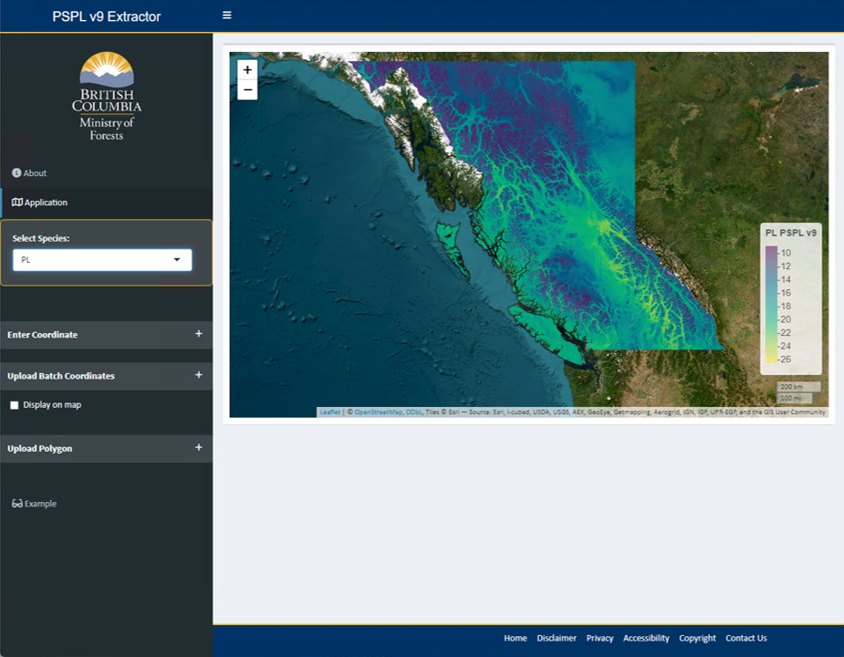
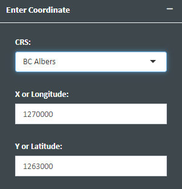
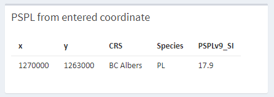
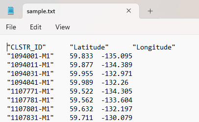
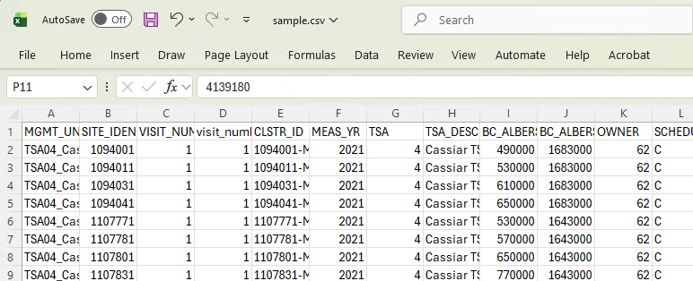
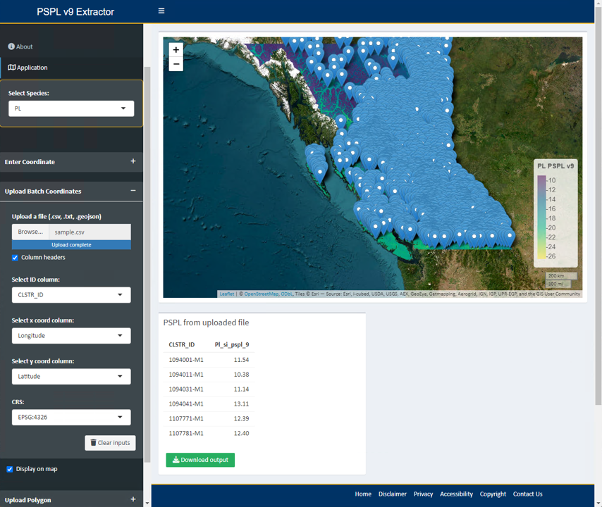
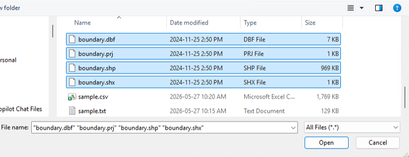
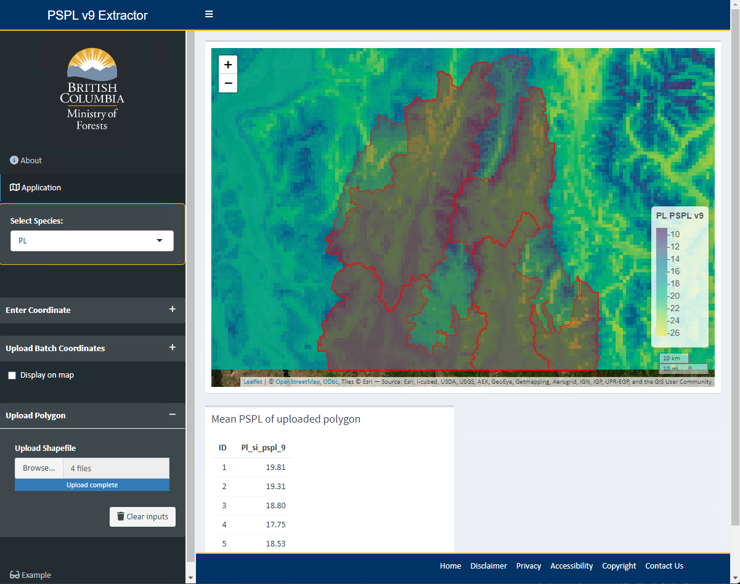

```{r setup, include=FALSE}
knitr::opts_chunk$set(echo = F)
```

## Background

The **Provincial Site Productivity Layer (PSPL)** provides **area-based site index estimates** for **14 commercial tree species across British Columbia (BC)**. The PSPL v.9.0 was developed and is managed by the Forest Analysis and Inventory Branch (FAIB) to address several limitations of PSPL v.8.0 by: 1) reducing discrepancies between PSPL estimates and field-measured site productivity, 2) filling gaps in estimates across large areas, and 3) establishing a more systematic and updateable modelling framework.  

PSPL v.9.0 adopts a machine learning-based *Random Forest (RF) modelling approach* that incorporates climatic, topographic, and ecosystem classification predictor variables. More than 13,000 ground-based site index observations from *FAIB ground sampling inventories, Site Index Biogeoclimatic Ecosystem Classification (SIBEC), and Site Index Adjustment (SIA) projects* were used to develop and validate the models. Validation results demonstrated that PSPL v.9.0 outperformed the previous v.8.0 in site index prediction accuracy for all species except black spruce, with particularly strong improvements for key commercial species including *Douglas-fir, lodgepole pine, western hemlock, western redcedar, and subalpine fir*. The new PSPL also establishes a reproducible and scalable predictive modelling framework that provides wall-to-wall coverage across BC at a **100 × 100 m spatial resolution**.


## Open Data

The PSPL v.9.0 is publicly available via [BC Data Catalogue](https://catalogue.data.gov.bc.ca/dataset/04ad45c3-0fdc-4506-bdb4-252c45a63459) subject to the [Open Government Licence - British Columbia](https://www2.gov.bc.ca/gov/content/data/policy-standards/data-policies/open-data/open-government-licence-bc).  


## References

For more info, visit [Provincial Site Productivity Layer webpage](https://www2.gov.bc.ca/gov/content/industry/forestry/managing-our-forest-resources/forest-inventory/site-productivity/provincial-site-productivity-layer).  


## Purpose of Web App

This web-based application was developed to facilitate custom queries and downloads of PSPL v.9.0 estimates for user-defined locations or areas of interest.  For complex analyses or large datasets, it is recommended to download the PSPL layers and perform processing in a local GIS or statistical environment.  

-  Users can specify a **single point** location to extract PSPL estimates, or upload a **list of points** for batch extraction.  
-  Users can upload a **spatial polygon** (*.shp*) to compute the mean PSPL value within a defined area.  
-  The maximum file size for uploading a list of points or a shapefileis is **30 MB**.  
-  Large input files or polygons covering extensive areas may require longer processing times.  


### User guide

Activate the **Application tab**  by clicking it. 

Select the **Species** of interest from the drop-down menu.  It may take a few seconds to load the PSPL raster layer. 



#### 1. Extract PSPL value of single point  


Unfold **Enter Coordinate** box by clicking the toggle on the right.    

Enter the x-coordinate, y-coordinate, and coordinate reference system (CRS) of the location of interest. For example:  




The application will begin extracting the PSPL value for the specified coordinate. This may take a few seconds.  

The result will be displayed below the map.  


 
 
#### 2. Batch extract PSPL values from a list of coordinates  
 
Unfold **Upload Batch Coordinates** box by clicking the toggle on the right.    

Upload a file containing list of coordinates (*.csv, .txt, or .geojson*). The file should contain columns of x-coordinate, y-coordinate, and an ID column for each row.  For example:  


{width=35%} {width=55%}


 
 After the file is uploaded, specify columns with of ID, x-coordinate, and y-coordinate from the drop-down button. Also select the CRS of the coordinate columns.  
 
The application will begin extracting the PSPL value, and the result will be displayed below the map.  




The list of extracted PSPL values can be downloaded via Download button.  
 
 
 
#### 3. Extract mean PSPL value within a polygon map
 
 
Unfold **Upload Polygon** box by clicking the toggle on the right.    

Upload components of a valid shapefile that contains at least the *.shp, .shx, .dbf*, and *.prj* files. For example:  

  

The application will begin extracting the PSPL values within the polygon and compute the mean.  If the shapefile contains multiple polygons, PSPL values will be averaged by each polygon.
 
The list of extracted and summarized PSPL values can be downloaded via Download button.  
 

 
 
 
 

